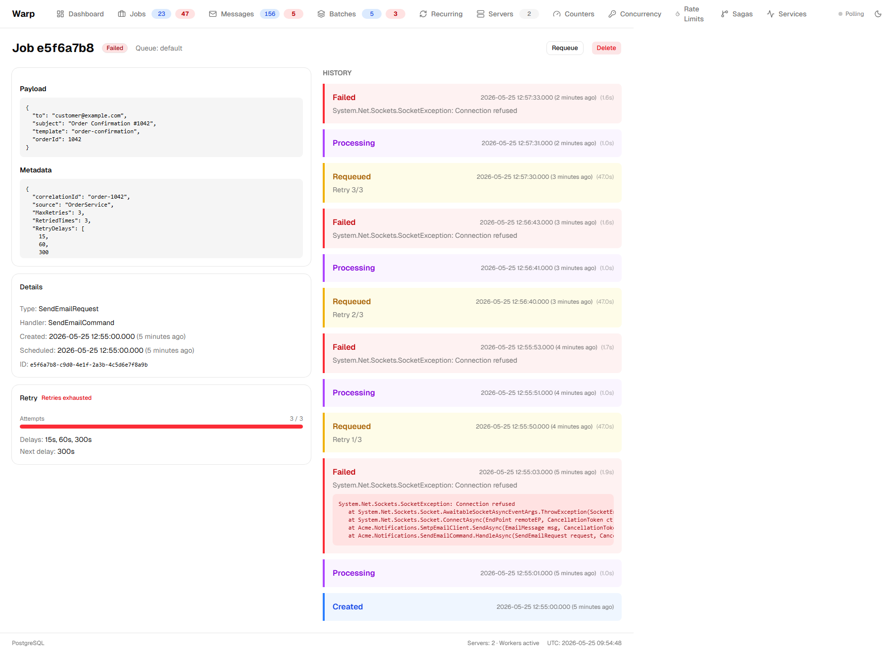

# UI Extensions

Warp's dashboard can be extended by external NuGet packages. Extensions can add new sections to existing pages, replace built-in components, insert content before/after any section, or add entirely new pages with navigation items.

## How It Works

The extension system has three layers:

1. **Backend (.NET)** — An `IWarpUIExtension` implementation declares a manifest and optionally registers API endpoints. The extension's JS file is shipped as an embedded resource and served by the middleware.

2. **Extension JS module** — A plain ES module that exports an `install()` function. It receives an API with `mount`, `append`, `insertBefore`, and `insertAfter` operations that target DOM elements by CSS selector.

3. **Frontend runtime** — The SPA fetches extension manifests after authentication, dynamically imports each extension's script, calls `install()`, and uses a `MutationObserver` to mount extension components as target elements appear in the DOM.

### Data Flow

```
1. User registers IWarpUIExtension in DI
2. UseWarpUI() discovers extensions, serves their embedded JS at /_ext/{name}/
3. GET /api/extensions returns all manifests (name, scriptUrl, pages)
4. SPA imports each extension's JS module
5. Extension's install() registers mount/append/insert operations via CSS selectors
6. MutationObserver watches for matching data-warp-slot elements
7. When found, extension component renders into/beside the target element
```

### Extension Slots

The dashboard marks key sections with `data-warp-slot` attributes. Extensions target these with CSS selectors. Each slot also has a `data-warp-context` attribute with JSON context (e.g., `{ "jobId": "..." }`).

**Job detail page slots:**
- `detail.header` — Title, state badge, action buttons
- `detail.progress` — Batch/message progress bar
- `detail.payload` — Payload JSON + metadata
- `detail.details` — Type, handler, timestamps, ID
- `detail.flow` — Flow card (trace, parent, continuations)
- `detail.history` — State history timeline
- `detail.logs` — Handler output

### Extension Operations

| Operation | What it does |
|-----------|-------------|
| `mount(selector, Component)` | **Replace** — hide original content, render extension instead |
| `append(selector, Component)` | **Add inside** — render at the end of the element |
| `insertBefore(selector, Component)` | **Add before** — render as a sibling above |
| `insertAfter(selector, Component)` | **Add after** — render as a sibling below |
| `addPage({ path, label, icon, component })` | **New page** — add a route and nav item |

### Shared Dependencies

Extensions don't bundle React or UI components. The host SPA exposes shared dependencies on `window.Warp`:

- `window.Warp.React` — React
- `window.Warp.ReactDOM` — ReactDOM
- `window.Warp.api` — Pre-configured Axios instance (base URL, auth cookie)
- `window.Warp.components` — shadcn/ui components (Card, Button, Badge, etc.)

## Building a UI Extension

### 1. Implement IWarpUIExtension

```csharp
using System.Reflection;
using Warp.UI.Extensions;
using Microsoft.AspNetCore.Routing;

public class RetryUIExtension : IWarpUIExtension
{
    public string Name => "retry";

    public Assembly ResourceAssembly => typeof(RetryUIExtension).Assembly;

    // Namespace where the embedded JS files live
    public string ResourceNamespace => "MyPackage.Extensions.Retry.dist";

    public UIExtensionManifest GetManifest()
    {
        return new UIExtensionManifest
        {
            Name = Name,
            ScriptUrl = $"/_ext/{Name}/index.js",
        };
    }

    public void MapEndpoints(IEndpointRouteBuilder endpoints)
    {
        // Optional: register custom API endpoints
        // endpoints.MapGet("/stats", async () => { ... });
    }
}
```

### 2. Write the JS Module

The extension JS uses `window.Warp` for React and UI components. No build step is required — plain ES modules work. For a better developer experience (JSX, TypeScript), use Vite in library mode with React externalized.

```javascript
const { React, api, components } = window.Warp;
const { createElement: h, useState, useEffect } = React;
const { Card, CardContent, CardHeader, CardTitle } = components;

function RetryCard(props) {
  const [job, setJob] = useState(null);

  useEffect(() => {
    if (!props.jobId) return;
    api.get('/detail/' + props.jobId).then(r => setJob(r.data));
  }, [props.jobId]);

  if (!job?.metadata?.MaxRetries) return null;

  const retried = job.metadata.RetriedTimes || 0;
  const max = job.metadata.MaxRetries;
  const pct = Math.round((retried / max) * 100);

  return h(Card, null,
    h(CardHeader, { className: 'pb-2' },
      h(CardTitle, { className: 'text-sm' }, 'Retry')),
    h(CardContent, { className: 'space-y-2 text-sm' },
      h('div', null,
        h('span', { className: 'text-muted-foreground' }, 'Attempts: '),
        retried + ' / ' + max),
      h('div', { className: 'h-2 bg-muted rounded-full overflow-hidden' },
        h('div', {
          className: 'h-full bg-yellow-500 rounded-full',
          style: { width: pct + '%' }
        }))
    )
  );
}

export function install(warp) {
  warp.insertAfter('[data-warp-slot="detail.details"]', RetryCard);
}
```

### 3. Embed the JS as a Resource

In your `.csproj`:

```xml
<ItemGroup>
  <EmbeddedResource Include="Extensions/Retry/dist/**/*" />
</ItemGroup>
```

### 4. Register in DI

```csharp
builder.Services.AddSingleton<IWarpUIExtension, RetryUIExtension>();
```

That's it. The extension's JS is served at `/warp/_ext/retry/index.js`, the SPA loads it after login, and the retry card appears on every job detail page that has retry metadata.

## Built-in Retry Extension

Warp ships a built-in retry UI extension that shows retry configuration and progress on the job detail page. It renders a card with:

- Status indicator ("Retry policy active", "Retrying...", or "Retries exhausted")
- Progress bar showing attempts vs max retries
- Delay schedule and next delay

The card only appears for jobs with retry metadata (`MaxRetries` set).



## Using Vite for JSX (Optional)

For extensions with complex UI, use Vite in library mode. This gives you JSX and TypeScript while externalizing React:

```typescript
// vite.config.ts
export default defineConfig({
  build: {
    lib: { entry: 'src/index.tsx', formats: ['es'], fileName: 'index' },
    rollupOptions: {
      external: ['react', 'react-dom'],
    },
  },
});
```

The extension code uses normal JSX:

```tsx
import React, { useState, useEffect } from 'react';
const { api, components: { Card, CardContent } } = window.Warp;

function MyDashboard() {
  const [data, setData] = useState(null);
  useEffect(() => { api.get('/ext/my-addon/stats').then(r => setData(r.data)); }, []);

  return (
    <Card>
      <CardContent>{data ? JSON.stringify(data) : 'Loading...'}</CardContent>
    </Card>
  );
}

export function install(warp) {
  warp.addPage({ path: '/my-addon', label: 'My Addon', icon: 'puzzle', component: MyDashboard });
  warp.insertAfter('[data-warp-slot="detail.details"]', MyDetailSection);
}
```

At build time, Vite externalizes `react` and `react-dom`. At runtime, configure an import map or use `window.Warp.React` directly.
